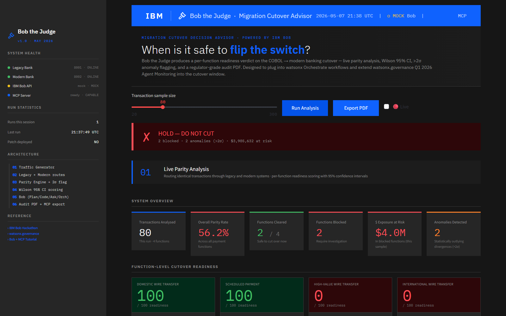
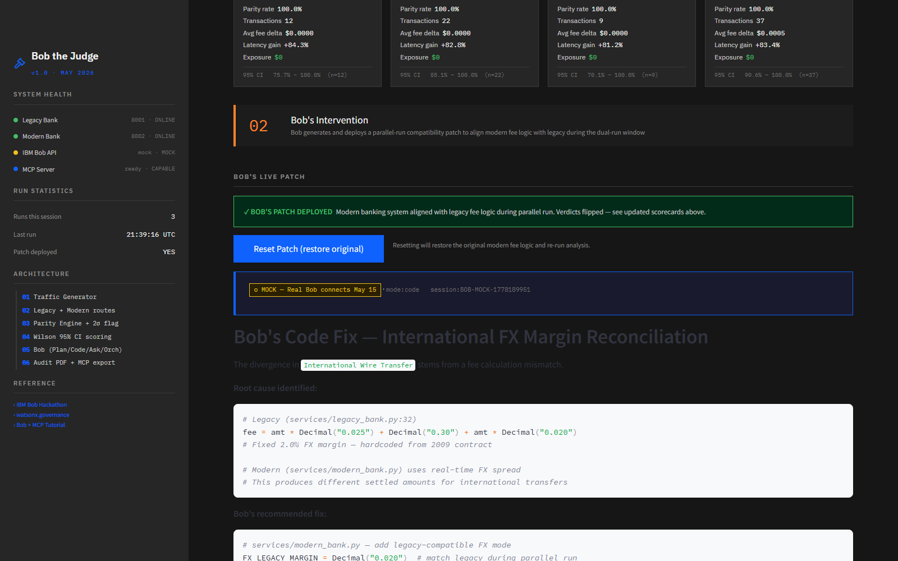

# Bob the Judge

**Migration Cutover Decision Advisor — Powered by IBM Bob.**

Built for the IBM Bob Hackathon 2026 (Lablab.ai, May 15–17).

> Bob writes the code. Bob ships it. **Bob the Judge tells Bob when to flip the switch.**



*Live parity analysis flags 2 blocked functions, 2 anomalies (>2σ), $3.9M at risk. Sidebar shows live system health for all 4 services (Legacy Bank, Modern Bank, IBM Bob API, MCP Server).*



*One click on "Apply Bob's Patch & Re-Analyse" — Bob generates the FX margin reconciliation patch, deploys it via the modern bank's admin endpoint, re-runs analysis, and all 4 functions flip to 100% parity. The audit trail captures Bob's code response inline.*

---

## What It Does

Enterprise migrations from COBOL to modern stacks stall in dual-run for months because no tool answers the question: *when is it safe to cut over?*

Bob the Judge produces a **per-function readiness verdict** (SAFE TO CUT / DO NOT CUT) by routing live traffic through both legacy and modern systems, scoring functional parity with a Wilson 95% confidence interval, flagging anomalies (>2σ), and exporting a regulator-grade audit PDF.

It runs Bob in all four modes — **Plan, Code, Ask, Orchestrator** — and exposes itself as an **MCP server** so Bob can query it directly from the IDE.

## Architecture

```
Traffic Generator  →  Legacy Bank  ┐
                                    ├→  Parity Engine  →  Scoring  →  Verdict
                  →  Modern Bank   ┘                       ↓
                                                    Bob (Plan/Code/Ask/Orchestrator)
                                                           ↓
                                                    Audit PDF  +  MCP Server
```

- **Legacy Bank** (`services/legacy_bank.py`) — FastAPI port 8001, COBOL-style fee logic
- **Modern Bank** (`services/modern_bank.py`) — FastAPI port 8002, modern Python logic, with `/admin/apply_patch` endpoints for the live patch-flip demo moment
- **Parity Engine** (`parity/parity_engine.py`) — sends N transactions through both, computes diffs, flags >2σ anomalies
- **Scoring** (`parity/scoring.py`) — Wilson 95% CI on parity rate per function
- **Bob Client** (`bob/client.py`) — talks to real IBM Bob when `BOB_API_KEY` is set, falls back to mock
- **Dashboard** (`dashboard.py`) — Streamlit, IBM Carbon styled, port 8501
- **MCP Server** (`mcp_server.py`) — FastMCP, exposes 4 tools to Bob's IDE
- **Audit PDF** (`audit/pdf_report.py`) — ReportLab, regulator-grade sign-off document

## Quick Start

```bash
# 1. Install deps (starlette pinned <1.0.0 for FastAPI compatibility)
pip install -r requirements.txt

# 2. Launch all services + dashboard
python launch.py

# 3. Open the dashboard
#    http://localhost:8501
```

Once dashboard is up:
1. Click **Run Analysis** — N=60 transactions through both systems
2. Review the 4 scorecards (2 SAFE, 2 DO NOT CUT by design for demo clarity)
3. Click **Apply Bob's Patch & Re-Analyse** — the demo wow moment, all 4 flip GREEN
4. Click **Export Audit PDF** — regulator sign-off document

## MCP Server (for Bob IDE)

Bob can query Bob the Judge directly using `bob-mcp-config.json`. Four tools exposed:

| Tool | Purpose |
|---|---|
| `analyze_cutover_readiness(n)` | Run a fresh analysis, return full report |
| `get_function_verdict(name)` | Per-function root cause + recommended action |
| `get_risk_summary()` | Executive dollar-exposure briefing |
| `list_monitored_functions()` | Lists all 4 payment functions |

Run standalone:
```bash
python mcp_server.py
```

> **Note:** `bob-mcp-config.json` contains a hardcoded `cwd` path pointing to the original dev machine. Before registering with Bob IDE, update the `cwd` field to match where you cloned this repo:
> ```json
> "cwd": "C:/your/path/to/bob-the-judge"
> ```

## IBM Roadmap Alignment

Bob the Judge **extends watsonx.governance Q1 2026 Agent Monitoring & Insights** into the COBOL → Java cutover window:

| watsonx.governance | Bob the Judge |
|---|---|
| Real-time agent decision tracking | Per-function readiness verdicts on live transactions |
| Threshold breach alerts | >2σ anomaly flagging + Wilson 95% CI gate |
| Continuous compliance reporting | One-click regulator-grade PDF |

Designed to plug into watsonx Orchestrate workflows.

## Project Layout

```
bob-the-judge/
├── README.md                       # this file
├── LICENSE                         # MIT
├── DEMO_SCRIPT.md                  # 3-minute demo script for the video
├── NEXT_ITERATION_PLAN.md          # v2 plan (produced by IBM Bob, see bob-sessions/A_plan.md)
├── MAY15_BOB_CAPTURE_PLAN.md       # historical capture plan (executed early 2026-05-08)
├── requirements.txt                # starlette pinned <1.0.0
├── launch.py                       # one-shot launcher: legacy + modern + dashboard
├── capture-sessions.ps1            # PowerShell script that launches all 4 Bob capture sessions
├── start.bat                       # Windows shortcut
├── dashboard.py                    # Streamlit UI (IBM Carbon styled)
├── mcp_server.py                   # FastMCP server (4 tools)
├── bob-mcp-config.json             # Bob IDE MCP registration
├── build_deck.py                   # rebuilds the pitch deck
├── Bob_the_Judge_Pitch_Deck.pptx   # 9-slide IBM Carbon styled deck
├── Bob_the_Judge_Pitch_Deck.pdf    # PDF render of the deck (font-fallback safe)
├── assets/gavel.svg                # judge's gavel icon (Lucide, MIT)
├── docs/screenshots/               # README screenshots (before/after patch)
├── services/                       # FastAPI legacy + modern banks
├── parity/                         # traffic, parity engine, scoring
├── audit/                          # ReportLab PDF builder
├── bob/                            # Bob client (real + mock fallback)
├── bob-sessions/                   # 4 IBM Bob sessions (Plan / Edit / Ask / Orchestrator)
├── test_parity.py                  # unit tests for parity engine
└── test_pdf.py                     # unit tests for audit PDF
```

## Bob Sessions

The `bob-sessions/` folder contains four IBM Bob sessions captured during development on **2026-05-08** (eight days before the submission deadline) using IBM Bob 1.109.5 + bob 1.0.2:

| Session | Bob Mode | Highlight |
|---|---|---|
| [`A_plan.md`](bob-sessions/A_plan.md) | Plan | 939-line v2 iteration plan citing FFIEC, Basel III, PSD2, OCC, EBA — 4 phases, 12 sprints, 8-risk register, full SQL schema |
| [`B_code.md`](bob-sessions/B_code.md) | Edit | Bob made live edits to `parity/scoring.py` — added `confidence_band` + `score_by_tenant()`, backward-compatible, tests pass |
| [`C_ask.md`](bob-sessions/C_ask.md) | Ask | Regulator-facing memo on per-function verdict defensibility, citing FFIEC IT Handbook, Basel III Pillar 2, PSD2 Art. 45, SWIFT gpi SLA, NIST AI RMF |
| [`D_orchestrator.md`](bob-sessions/D_orchestrator.md) | Orchestrator | 4-stage cutover pipeline with Stage 4 **delegated to an Ask-mode sub-task** — real multi-agent meta-coordination; cited actual codebase line `modern_bank.py:35` |

This satisfies the Lablab.ai submission requirement to include exported Bob reports of all relevant tasks/sessions used for the project.

The MCP server registered with Bob means anyone running this repo can ask Bob to query Bob the Judge from inside their Bob IDE — `bobide --add-mcp` already wires it.

## Tech Stack

- Python 3.11+
- FastAPI 0.115 + Uvicorn (legacy and modern banks)
- Streamlit 1.39 + Plotly 5.24 (dashboard)
- ReportLab 4.2 (audit PDF)
- pandas 2.2 (data wrangling)
- mcp >= 1.0 (FastMCP server)
- starlette < 1.0 (FastAPI compatibility — do not auto-upgrade)
- IBM Plex Sans / Mono / Serif (UI typography)


## License

MIT.
