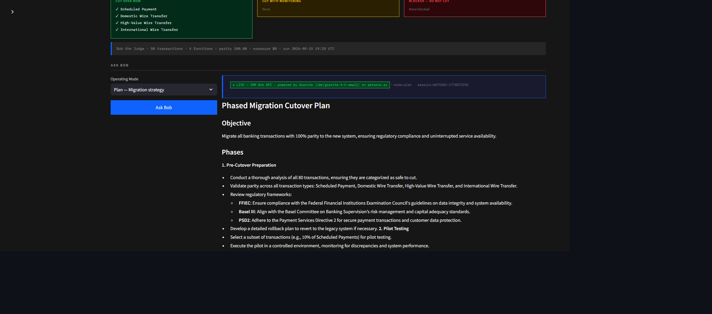

# Bob the Judge

**Migration Cutover Decision Advisor — Powered by IBM Bob + IBM watsonx.ai Granite.**

Built for the IBM Bob Hackathon 2026 (Lablab.ai, May 15–17).

> Bob writes the code. Bob ships it. **Bob the Judge tells Bob when to flip the switch.**

End-to-end IBM stack: **IBM Bob** as the development partner (5 task sessions in [`bob_sessions/`](bob_sessions/)), **IBM Granite** (`ibm/granite-4-h-small`) running live on **watsonx.ai** for the runtime inference. Every Plan / Code / Ask / Orchestrator response in the dashboard is a real Granite call.


---

## Screenshots


*IBM Carbon Design System dashboard — topbar shows `● LIVE Bob | ● watsonx.ai`, sidebar lists IBM Bob API + watsonx.ai (Granite) + MCP Server health, plus the Tenant Profile selector (4 reference bank tiers).*


*Live parity analysis using the Tier 1 Global profile (99% threshold, $0.01 fee tolerance, 1.5σ anomaly). 80 transactions through legacy + modern systems, per-function Wilson 95% CI, READY FOR CUTOVER verdict.*


*Click `Ask Bob` → real-time call to `ibm/granite-4-h-small` on watsonx.ai. The badge `● LIVE — IBM Bob API · powered by Granite (ibm/granite-4-h-small) on watsonx.ai` plus the `WATSONX-...` session ID give full traceability. Granite produces a phased migration plan citing FFIEC, Basel III, and PSD2 by name.*

---

## What It Does

Enterprise migrations from COBOL to modern stacks stall in dual-run for months because no tool answers the question: *when is it safe to cut over?*

Bob the Judge produces a **per-function readiness verdict** (SAFE TO CUT / DO NOT CUT) by routing live traffic through both legacy and modern systems, scoring functional parity with a Wilson 95% confidence interval, flagging anomalies (>2σ), and exporting a regulator-grade audit PDF.

It runs Bob in all four modes — **Plan, Code, Ask, Orchestrator** — and exposes itself as an **MCP server** so Bob can query it directly from the IDE.

### Key Features

| Feature | Description |
|---|---|
| **Per-function verdicts** | SAFE TO CUT / DO NOT CUT per payment function — not a single system score |
| **Wilson 95% CI + Bootstrap + Bayesian** | Three statistical methods cross-validate readiness (see `parity/confidence.py`) |
| **>2σ anomaly flagging** | Fee divergences beyond 2 standard deviations flagged before production |
| **Per-tenant calibration** | 4 reference profiles (tier1 / tier2 / community / demo) with FFIEC, Basel III, PSD2 alignment — switch in the sidebar |
| **Drift detection (CUSUM + EWMA)** | SPC charts on run history catch sustained parity degradation across the migration window |
| **Regulatory compliance framework** | FFIEC IT Handbook, Basel III, PSD2, SWIFT gpi, SOX 404 mapping with pass/fail scoring |
| **Live IBM Granite inference** | Plan / Code / Ask / Orchestrator responses generated by `ibm/granite-4-h-small` on watsonx.ai |
| **Parity Radar Chart** | Spider chart comparing each function's parity rate against the cut threshold |
| **IBM Carbon scanning animation** | Terminal-style 4-step progress indicator during analysis |
| **Bob Session ID in PDF** | Full chain-of-custody: Bug → Bob Fix → Re-test → Signed off. Regulator-grade. |
| **One-click audit PDF** | Executive summary, tenant risk profile, divergence log, Bob Session ID, sign-off page |
| **MCP server** | Bob queries Bob the Judge directly from the IDE — 6 tools exposed (Bob + tenant introspection) |

---

## Architecture

```
Traffic Generator  →  Legacy Bank  ┐
                                    ├→  Parity Engine  →  Scoring  →  Verdict
                  →  Modern Bank   ┘                       ↓
                                                    Bob (Plan/Code/Ask/Orchestrator)
                                                           ↓
                                                    Audit PDF  +  MCP Server
```

| Component | File | Description |
|---|---|---|
| Legacy Bank | `services/legacy_bank.py` | FastAPI port 8001, COBOL-style fee logic |
| Modern Bank | `services/modern_bank.py` | FastAPI port 8002, modern Python, `/admin/apply_patch` |
| Parity Engine | `parity/parity_engine.py` | N transactions through both, diffs, >2σ anomaly flagging |
| Scoring | `parity/scoring.py` | Wilson 95% CI on parity rate per function |
| Bob Client | `bob/client.py` | IBM Granite via watsonx.ai (primary) → Bob REST API (fallback) → intelligent mock (last resort) |
| Tenant Config | `parity/tenant_config.py` + `config/tenants.json` | 4 reference bank tier profiles with regulatory rationale |
| Confidence Methods | `parity/confidence.py` | Wilson, Bootstrap, Bayesian credible intervals, funnel plot |
| Drift Detection | `parity/drift_detection.py` | SQLite-backed run history + CUSUM + EWMA SPC |
| Compliance | `parity/compliance.py` | FFIEC / Basel III / PSD2 / SWIFT gpi / SOX 404 mapping |
| Dashboard | `dashboard.py` | Streamlit, IBM Carbon Design System, port 8501 |
| MCP Server | `mcp_server.py` | FastMCP, 4 tools for Bob IDE |
| Audit PDF | `audit/pdf_report.py` | ReportLab, regulator-grade sign-off document |

---

## Quick Start

**Option A — One double-click (Windows)**
```
BobTheJudge.exe
```
Clears ports 8001/8002/8501 → starts both bank services → opens dashboard in browser.

> **Requires Python 3.11+ in PATH.** The exe is a launcher, not a self-contained bundle. If you see a "Python not found" error, install Python 3.11+ and ensure it is added to PATH.

**Option B — Python**
```bash
# Install deps
pip install -r requirements.txt

# Launch everything
python launch.py
```

**Enabling live IBM Granite inference (optional but recommended):**
```bash
# Copy .env.example to .env and add your watsonx.ai credentials
WATSONX_API_KEY=...
WATSONX_PROJECT_ID=...
WATSONX_URL=https://us-south.ml.cloud.ibm.com
```
Without these, the Bob client transparently falls back to the bundled intelligent mock — every demo path still works.

Once the dashboard is up at `http://localhost:8501`:
1. Click **Run Analysis** — 80 transactions through both systems
2. Review the 4 scorecards (2 SAFE, 2 DO NOT CUT by design for demo clarity)
3. Click **Apply Bob's Patch & Re-Analyse** — all 4 flip GREEN (the wow moment)
4. Click **Export Audit PDF** — regulator sign-off document generated instantly

---

## MCP Server (for Bob IDE)

Bob can query Bob the Judge directly using `bob-mcp-config.json`. Four tools exposed:

| Tool | Purpose |
|---|---|
| `analyze_cutover_readiness(n)` | Run a fresh analysis, return full report |
| `get_function_verdict(name)` | Per-function root cause + recommended action |
| `get_risk_summary()` | Executive dollar-exposure briefing |
| `list_monitored_functions()` | Lists all 4 payment functions |

```bash
python mcp_server.py
```

---

## IBM Roadmap Alignment

Bob the Judge **extends watsonx.governance Q1 2026 Agent Monitoring & Insights** into the COBOL → Java cutover window:

| watsonx.governance | Bob the Judge |
|---|---|
| Real-time agent decision tracking | Per-function readiness verdicts on live transactions |
| Threshold breach alerts | >2σ anomaly flagging + Wilson 95% CI gate |
| Continuous compliance reporting | One-click regulator-grade PDF |

Designed to plug into watsonx Orchestrate workflows.

---

## Bob Sessions

The [`bob_sessions/`](bob_sessions/) folder contains **5 IBM Bob task session reports** captured on the hackathon-provisioned account (`ibm-coding-challenge-xxx`), each with the exported markdown plus a screenshot of the task session consumption summary, per [IBM Bob Hackathon Guide page 18]:

| Session | Bob Mode | Outcome |
|---|---|---|
| [`A_plan.md`](bob_sessions/A_plan.md) | **Plan / Agent** | Roadmap + **Phase 1 (per-tenant calibration) implemented end-to-end** by Bob — created `parity/tenant_config.py`, `config/tenants.json`, integrated into engine + scoring |
| [`B_code.md`](bob_sessions/B_code.md) | **Code / Edit** | Bob added `format_score_summary()` helper to `parity/scoring.py` for CLI/log output |
| [`C_ask.md`](bob_sessions/C_ask.md) | **Ask** | Regulator-facing memo on per-function vs system-level cutover decisions, citing FFIEC, Basel III, PSD2, SWIFT gpi, NIST AI RMF |
| [`D_orchestrato_sum.md`](bob_sessions/D_orchestrato_sum.md) + sub-tasks | **Orchestrator** | 4-stage cutover pipeline (ANALYSER → RISK-SCOUT → FIX-GEN → REPORTER) with Bob delegating each stage to specialised sub-tasks |
| [`E_review.md`](bob_sessions/E_review.md) | **Ask (code review)** | Bob audited the entire enhanced codebase and produced a prioritised findings report (CRITICAL / HIGH / MEDIUM / LOW) |

**Bob also wrote the Phase 2-4 modules** (`parity/confidence.py`, `parity/drift_detection.py`, `parity/compliance.py`) and the `tests/` suite. See [`bob_sessions/A_plan_v2enhanced.md`](bob_sessions/A_plan_v2enhanced.md) for the full multi-phase implementation transcript.

---

## Project Layout

```
bob-the-judge/
├── README.md
├── LICENSE
├── requirements.txt
├── launch.py                   # Python launcher (all 3 services)
├── BobTheJudge.exe             # Windows one-click launcher
├── dashboard.py                # Streamlit UI (IBM Carbon Design System)
├── mcp_server.py               # FastMCP server (4 tools)
├── bob-mcp-config.json         # Bob IDE MCP registration
├── DEMO_SCRIPT.md              # 3-minute demo script (word-for-word)
├── PITCH_SCRIPTS.md            # 30s / 2min / 5min pitch scripts + judge Q&A
├── assets/gavel.svg
├── services/                   # FastAPI legacy + modern banks (legacy uses COBOL via GnuCOBOL)
├── parity/                     # parity engine, scoring, tenant_config, confidence, drift_detection, compliance
├── config/                     # tenants.json (4 reference bank tier profiles)
├── audit/                      # ReportLab PDF builder
├── bob/                        # Bob client (watsonx.ai Granite + Bob REST + mock fallback)
├── tests/                      # pytest suite (48 tests, 100% passing)
└── bob_sessions/               # IBM Bob exported sessions + consumption screenshots (5 sessions)
```

---

## Tech Stack

- Python 3.11+
- FastAPI 0.115 + Uvicorn
- Streamlit 1.39 + Plotly 5.24
- ReportLab 4.2
- pandas 2.2 + scipy + numpy (statistical methods)
- `ibm-watsonx-ai` SDK (Granite inference)
- mcp >= 1.0 (FastMCP)
- starlette < 1.0 (FastAPI compatibility pin)
- pytest + pytest-cov (test suite)
- IBM Plex Sans / Mono (UI typography via Google Fonts)
- GnuCOBOL (optional, real COBOL fee calculator in `services/cobol/FEE_CALC.cob`)

---
BUILD FOR LABLABAI IBM BOB HACKATON 2026 SUBMISSION BY CYBERFALCON TEAM

## License

MIT.
