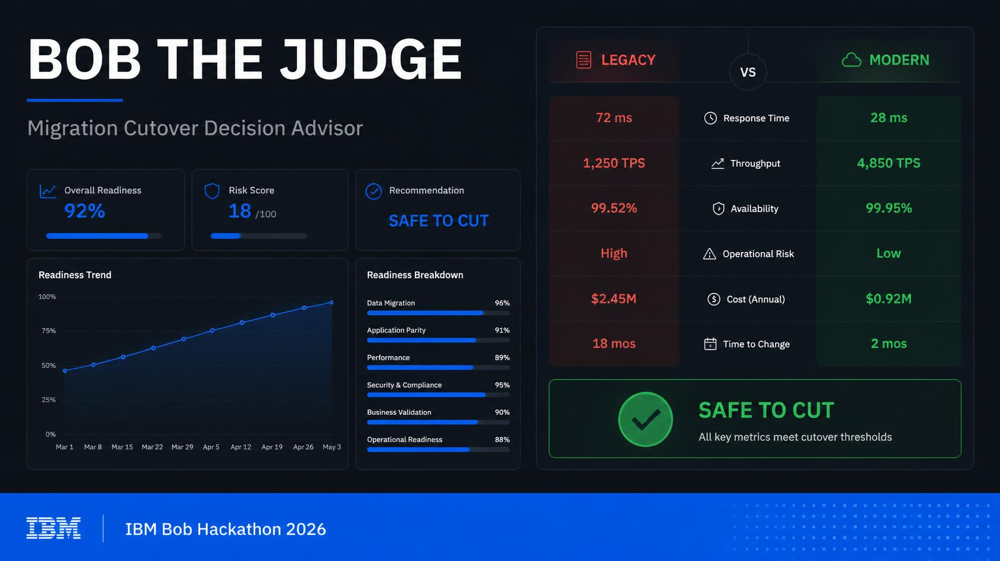
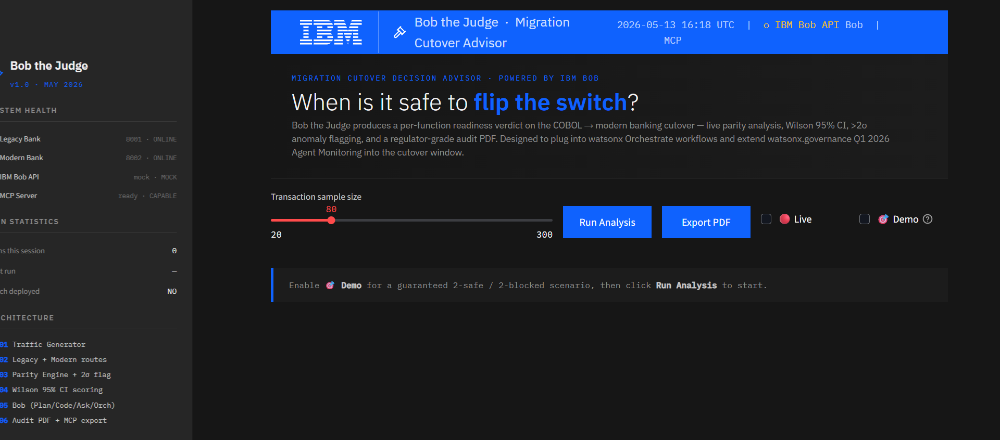
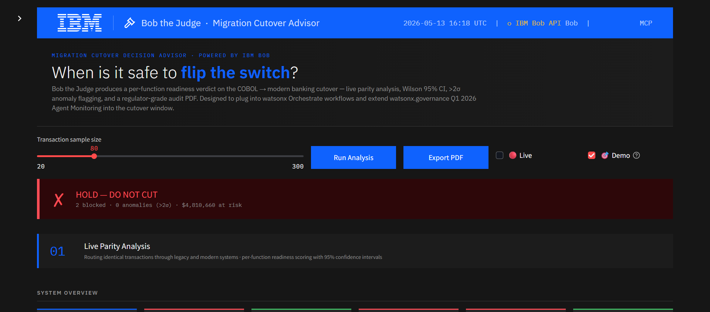

# Bob the Judge

**Migration Cutover Decision Advisor — Powered by IBM Bob.**

Built for the IBM Bob Hackathon 2026 (Lablab.ai, May 15–17).

> Bob writes the code. Bob ships it. **Bob the Judge tells Bob when to flip the switch.**



---

## Screenshots


*IBM Carbon Design System dashboard — IBM logo in topbar, sidebar system health, hero band.*


*Live parity analysis: 2 functions blocked, $4.8M at risk. Decision banner shows HOLD — DO NOT CUT.*

---

## What It Does

Enterprise migrations from COBOL to modern stacks stall in dual-run for months because no tool answers the question: *when is it safe to cut over?*

Bob the Judge produces a **per-function readiness verdict** (SAFE TO CUT / DO NOT CUT) by routing live traffic through both legacy and modern systems, scoring functional parity with a Wilson 95% confidence interval, flagging anomalies (>2σ), and exporting a regulator-grade audit PDF.

It runs Bob in all four modes — **Plan, Code, Ask, Orchestrator** — and exposes itself as an **MCP server** so Bob can query it directly from the IDE.

---

## Architecture

```
Traffic Generator  →  Legacy Bank  ┐
                                    ├→  Parity Engine  →  Scoring  →  Verdict
                  →  Modern Bank   ┘                       ↓
                                                    Bob (Plan/Code/Ask/Orchestrator)
                                                           ↓
                                                    Audit PDF  +  MCP Server
```

| Component | File | Description |
|---|---|---|
| Legacy Bank | `services/legacy_bank.py` | FastAPI port 8001, COBOL-style fee logic |
| Modern Bank | `services/modern_bank.py` | FastAPI port 8002, modern Python, `/admin/apply_patch` |
| Parity Engine | `parity/parity_engine.py` | N transactions through both, diffs, >2σ anomaly flagging |
| Scoring | `parity/scoring.py` | Wilson 95% CI on parity rate per function |
| Bob Client | `bob/client.py` | Real IBM Bob when `BOB_API_KEY` set, intelligent mock otherwise |
| Dashboard | `dashboard.py` | Streamlit, IBM Carbon Design System, port 8501 |
| MCP Server | `mcp_server.py` | FastMCP, 4 tools for Bob IDE |
| Audit PDF | `audit/pdf_report.py` | ReportLab, regulator-grade sign-off document |

---

## Quick Start

**Option A — One double-click (Windows)**
```
BobTheJudge.exe
```
Clears ports 8001/8002/8501 → starts both bank services → opens dashboard in browser.

**Option B — Python**
```bash
# Install deps
pip install -r requirements.txt

# Launch everything
python launch.py
```

Once the dashboard is up at `http://localhost:8501`:
1. Click **Run Analysis** — 80 transactions through both systems
2. Review the 4 scorecards (2 SAFE, 2 DO NOT CUT by design for demo clarity)
3. Click **Apply Bob's Patch & Re-Analyse** — all 4 flip GREEN (the wow moment)
4. Click **Export Audit PDF** — regulator sign-off document generated instantly

---

## MCP Server (for Bob IDE)

Bob can query Bob the Judge directly using `bob-mcp-config.json`. Four tools exposed:

| Tool | Purpose |
|---|---|
| `analyze_cutover_readiness(n)` | Run a fresh analysis, return full report |
| `get_function_verdict(name)` | Per-function root cause + recommended action |
| `get_risk_summary()` | Executive dollar-exposure briefing |
| `list_monitored_functions()` | Lists all 4 payment functions |

```bash
python mcp_server.py
```

---

## IBM Roadmap Alignment

Bob the Judge **extends watsonx.governance Q1 2026 Agent Monitoring & Insights** into the COBOL → Java cutover window:

| watsonx.governance | Bob the Judge |
|---|---|
| Real-time agent decision tracking | Per-function readiness verdicts on live transactions |
| Threshold breach alerts | >2σ anomaly flagging + Wilson 95% CI gate |
| Continuous compliance reporting | One-click regulator-grade PDF |

Designed to plug into watsonx Orchestrate workflows.

---

## Bob Sessions

The `bob-sessions/` folder contains four IBM Bob sessions captured during development on **2026-05-08** using IBM Bob 1.109.5 + bob 1.0.2:

| Session | Bob Mode | Highlight |
|---|---|---|
| [`A_plan.md`](bob-sessions/A_plan.md) | Plan | 939-line v2 iteration plan citing FFIEC, Basel III, PSD2, OCC, EBA |
| [`B_code.md`](bob-sessions/B_code.md) | Edit | Live edits to `parity/scoring.py` — added `confidence_band` + `score_by_tenant()` |
| [`C_ask.md`](bob-sessions/C_ask.md) | Ask | Regulator memo citing FFIEC IT Handbook, Basel III Pillar 2, PSD2 Art. 45 |
| [`D_orchestrator.md`](bob-sessions/D_orchestrator.md) | Orchestrator | 4-stage cutover pipeline with Stage 4 delegated to an Ask-mode sub-task |

---

## Project Layout

```
bob-the-judge/
├── README.md
├── LICENSE
├── requirements.txt
├── launch.py                   # Python launcher (all 3 services)
├── BobTheJudge.exe             # Windows one-click launcher
├── dashboard.py                # Streamlit UI (IBM Carbon Design System)
├── mcp_server.py               # FastMCP server (4 tools)
├── bob-mcp-config.json         # Bob IDE MCP registration
├── DEMO_SCRIPT.md              # 3-minute demo script
├── assets/gavel.svg
├── services/                   # FastAPI legacy + modern banks
├── parity/                     # traffic generator, parity engine, scoring
├── audit/                      # ReportLab PDF builder
├── bob/                        # Bob client (real + mock fallback)
└── bob-sessions/               # 4 IBM Bob exported sessions
```

---

## Tech Stack

- Python 3.11+
- FastAPI 0.115 + Uvicorn
- Streamlit 1.39 + Plotly 5.24
- ReportLab 4.2
- pandas 2.2
- mcp >= 1.0 (FastMCP)
- starlette < 1.0 (FastAPI compatibility pin)
- IBM Plex Sans / Mono (UI typography via Google Fonts)

---
BUILD FOR LABLABAI IBM BOB HACKATON 2026 SUBMISSION BY CYBERFALCON TEAM

## License

MIT.
